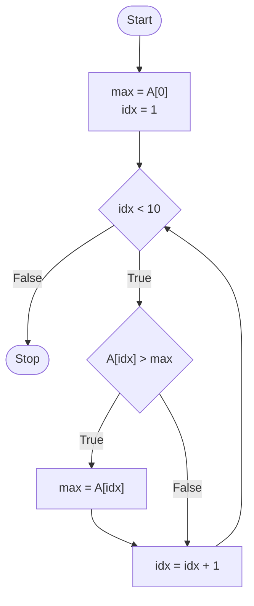
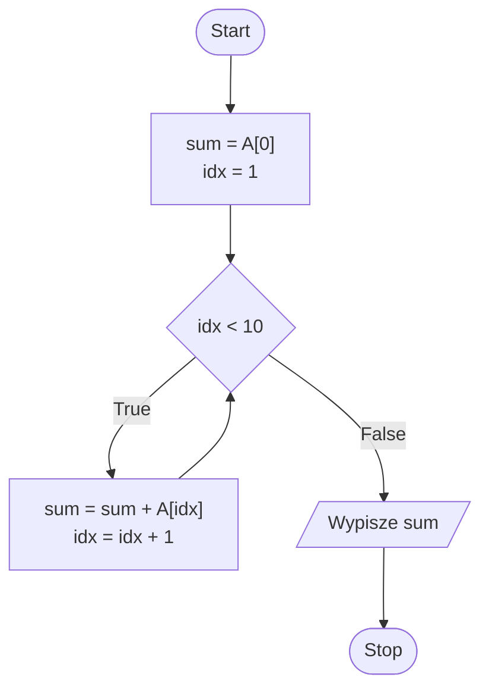
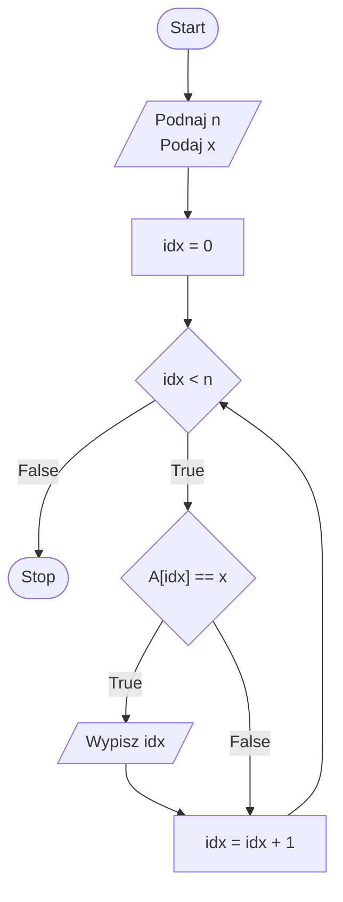
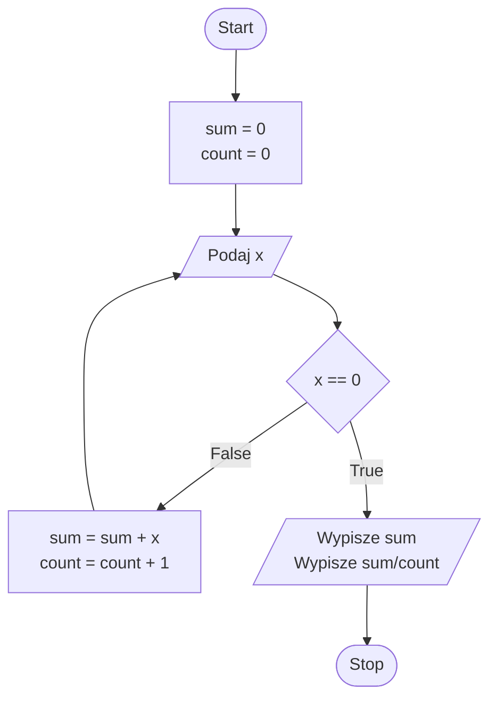
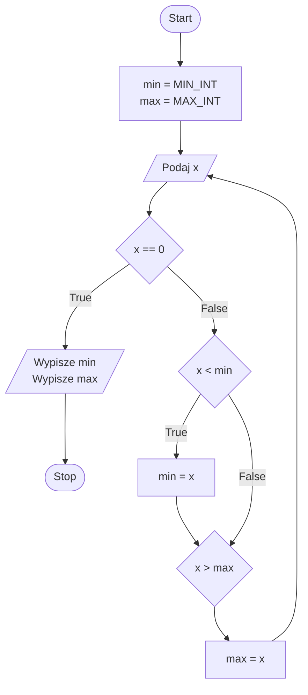
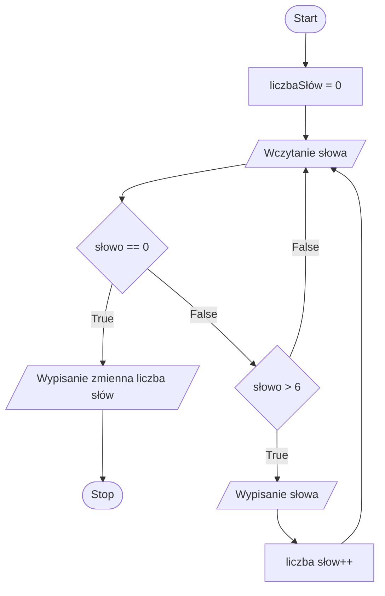

## Zadanie 1

Narysuj schemat blokowy znajdujący największą liczbę w 10-elementowej tablicy.



## Zadanie 2

Narysuj schemat blokowy, który doda wszystkie elementy w 10-elementowej tablicy, a wynik wypisze na ekranie.



## Zadanie 3

Narysuj schemat blokowy wypisujący wszystkie pozycje, na których w tablicy ```A[0, . . . , n-1] ``` znajduje się liczba **x**.



## Zadanie 4

Narysuj schemat blokowy programu, który wczytuje liczby do momentu wystąpienia 0 oraz oblicza ich sumę i średnią.
Gdy wystąpi 0 wypisze wartość sumy oraz średnią arytmetyczną.



## Zadanie 5

Narysuj schemat blokowy programu, który wczytuje liczby do momentu wystąpienia 0.
Gdy wystąpi 0 wypisze maksymalną i minimalną wartość.



## Zadanie 6

Narysuj schemat blokowy programu, który wczytuje słowa do momentu wystąpienia 0, jeżeli liczba znaków jest większa od 6
słowo zostanie wyświetlone.
Gdy wystąpi 0, wypisze ile było słów, w których liczba znaków była mniejsza bądź równa 6.


