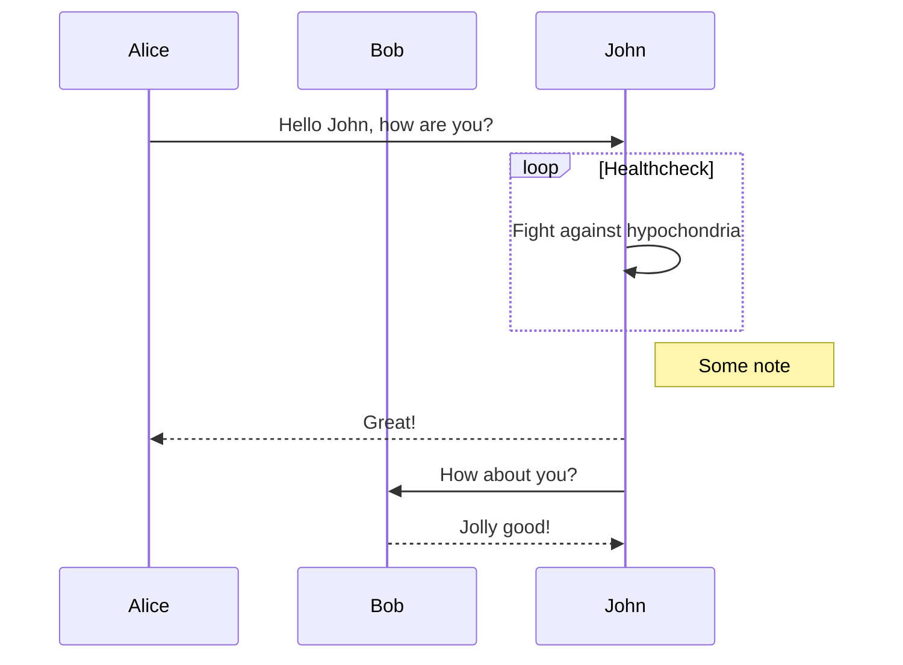
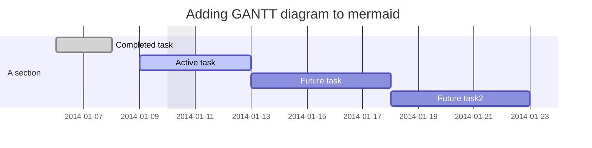
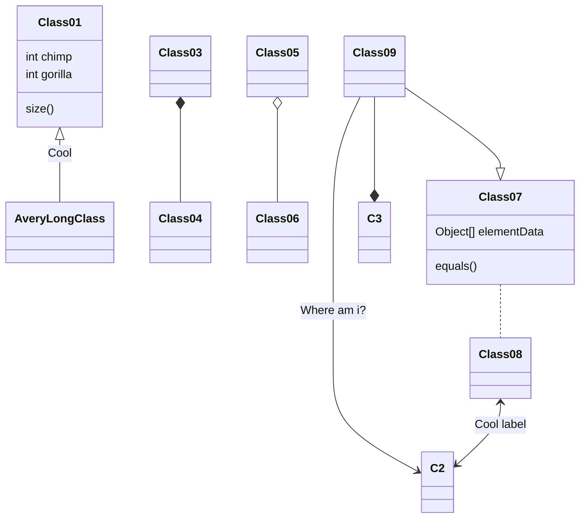

## Zadanie 1

Narysuj schemat blokowy znajdujący największą liczbę w 10-elementowej tablicy.

```flowchart
st=>start: Start
e=>end: Stop
op1=>operation: max = A[0]
idx = 1   
op2=>operation: max = A[idx]
op3=>operation: idx = idx + 1
c1=>condition: idx < 10 | no
c2=>condition: A[idx] > max | no

st->op1->c1
c1(yes)->c2
c1(no, left)->e
c2(yes)->op2->op3->
op3(bottom)->c1(left)->
```

## Zadanie 2

Narysuj schemat blokowy, który doda wszystkie elementy w 10-elementowej tablicy, a wynik wypisze na ekranie.

```flowchart
st=>start: Start
e=>end: Stop
op1=>operation: sum = A[0]
idx = 1
op2=>operation: sum = sum + A[idx]
idx = idx + 1
io1=>inputoutput: Wypisz sum
c1=>condition: idx < 10

st->op1->c1->
c1(no,left)->io1()->e->
c1(yes)->op2(bottom)->c1->
```

## Zadanie 3

Narysuj schemat blokowy wypisujący wszystkie pozycje, na których w tablicy ```A[0, . . . , n-1] ``` znajduje się liczba **x**.

```flowchart
st=>start: Start
e=>end: Stop
op1=>operation: idx = 0
op2=>operation: idx = idx + 1
io1=>inputoutput: Podan n
Podaj x
io2=>inputoutput: Wypisze idx
c1=>condition: idx < n
c2=>condition: A[idx] == x

st->io1->op1
op1->c1(no)->e->
c1(yes)->c2(yes)->io2->
c2(no)->op2->
io2->op2(left)->c1->
```

## Zadanie 4

Narysuj schemat blokowy programu, który wczytuje liczby do momentu wystąpienia 0 oraz oblicza ich sumę i średnią.
Gdy wystąpi 0 wypisze wartość sumy oraz średnią arytmetyczną.

```flowchart
st=>start: Start
e=>end: Stop
op1=>operation: sum = 0
count = 0
op2=>operation: sum = sum + x
count = count + 1
io1=>inputoutput: Podaj x
io2=>inputoutput: Wypisz sum
Wypisz sum/count
c1=>condition: x == 0

st->op1->io1->c1
c1(no)->op2(left)->io1
c1(yes,right)->io2()->e->
```

## Zadanie 5

Narysuj schemat blokowy programu, który wczytuje liczby do momentu wystąpienia 0.
Gdy wystąpi 0 wypisze maksymalną i minimalną wartość.

```flowchart
st=>start: Start
e=>end: Stop
op1=>operation: min = MIN_INT
max = MAX_INT
op2=>operation: min = x
op3=>operation: max = x
io1=>inputoutput: Podaj x
io2=>inputoutput: Wypisze min
Wypisze max
c1=>condition: x == 0
c2=>condition: x < min
c3=>condition: x > max

st->op1->io1->c1->
c1(yes,right)->io2(right)->e->
c1(no)->c2->
c2(true)->op2->c3->
c3(true)->op3(left)->io1
c3(no,left)->io1
c2(no)->c3->
```

## Zadanie 6

Narysuj schemat blokowy programu, który wczytuje słowa do momentu wystąpienia 0, jeżeli liczba znaków jest większa od 6
słowo zostanie wyświetlone.
Gdy wystąpi 0, wypisze ile było słów, w których liczba znaków była mniejsza bądź równa 6.

```flowchart
st=>start: Start
e=>end: Stop
op1=>operation: liczbaSłów = 0
op2=>operation: liczbaSłów++
io1=>inputoutput: Wczytywanie słowa
io2=>inputoutput: Wpisanie słowa
io3=>inputoutput: wpisz zmienna liczbaSłów
c1=>condition: słowo == 0
c2=>condition: słowo > 6

st->op1->io1->c1
c1(no,bottom)->c2
c1(yes,right)->io3->e
c2(yes)->io2->op2(left)->io1
c2(no,left)->io1
```


```vega-lite
{
  "data": {
    "values": [
      {"a": "C", "b": 2}, {"a": "C", "b": 7}, {"a": "C", "b": 4},
      {"a": "D", "b": 1}, {"a": "D", "b": 2}, {"a": "D", "b": 6},
      {"a": "E", "b": 8}, {"a": "E", "b": 4}, {"a": "E", "b": 7}
    ]
  },
  "mark": "point",
  "encoding": {
    "x": {"field": "a", "type": "nominal"},
    "y": {"field": "b", "type": "quantitative"}
  }
}
```

## Flowchart

```flowchart
st=>start: Start|past
e=>end: End|future
op1=>operation: My Operation|past
op2=>operation: Stuff|current
sub1=>subroutine: My Subroutine|invalid
cond=>condition: Yes
or No?|approved:>http://www.google.com
c2=>condition: Good idea|rejected
io=>inputoutput: catch something...|future
st->op1(right)->cond
cond(yes, right)->c2
cond(no)->sub1(left)->op1
c2(yes)->io->e
c2(no)->op2->e
```

## Sequence diagram

```sequence
Title: Here is a title
A->B: Normal line
B-->C: Dashed line
C->>D: Open arrow
D-->>A: Dashed open arrow
```

## Flowchart


## Sequence diagram



## Gantt diagram



## Class diagram (experimental)


